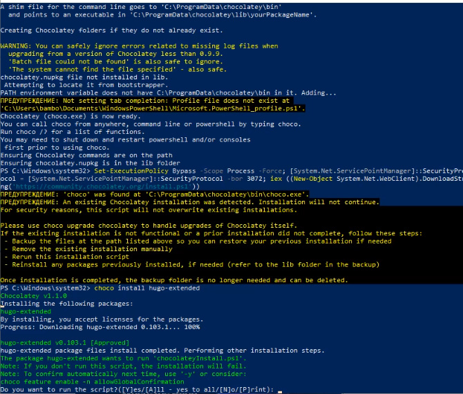
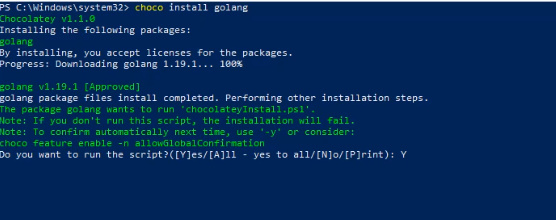
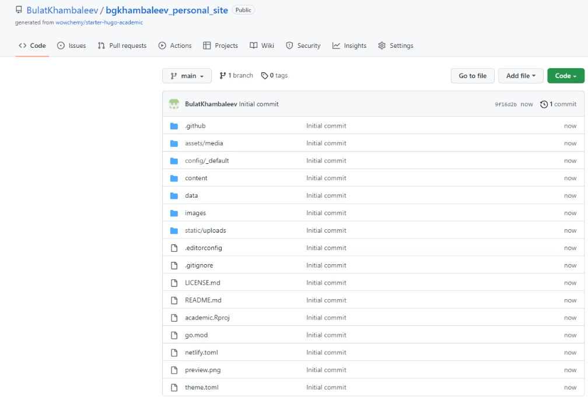
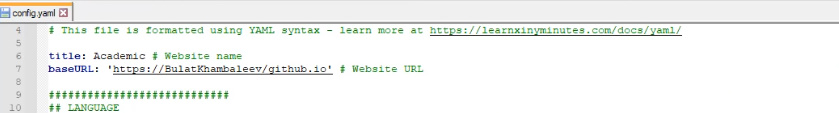
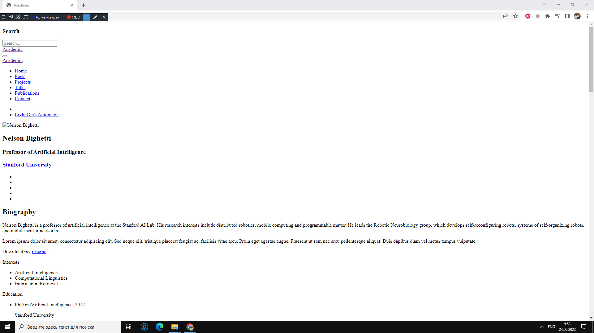

---
## Front matter
lang: ru-RU
title: Отчет по индвидуальному проекту, этап 1
author: 'Хамбалеев Булат Галимович'
date: 24 сентября, 2022

## Formatting
toc: false
slide_level: 2
theme: metropolis
mainfont: Ubuntu
romanfont: Ubuntu
sansfont: Ubuntu
monofont: Ubuntu
header-includes: 
 - \metroset{progressbar=frametitle,sectionpage=progressbar,numbering=fraction}
 - '\makeatletter'
 - '\beamer@ignorenonframefalse'
 - '\makeatother'
aspectratio: 43
section-titles: true
---

## Цель работы

Размещение на Github pages заготовки для персонального сайта.

## Задание

Данный этап индвидуального проекта подразумевает установку необходимого программного обеспечения и первоначальной настройки сайта.

# Выполнение лабораторной работы

1. Установка hugo.

{ #fig:001 width=70% }

---

2. Установка golang.

{ #fig:002 width=70% }

---

3. Клонируем репозиторий с шаблоном сайта.

{ #fig:003 width=70% }

---

4. Установим параметр URLs.

{ #fig:004 width=70% }

---

5. Разместим заготовку сайта на Github pages.

{ #fig:005 width=70% }

---

## {.standout}

Спасибо за внимание
