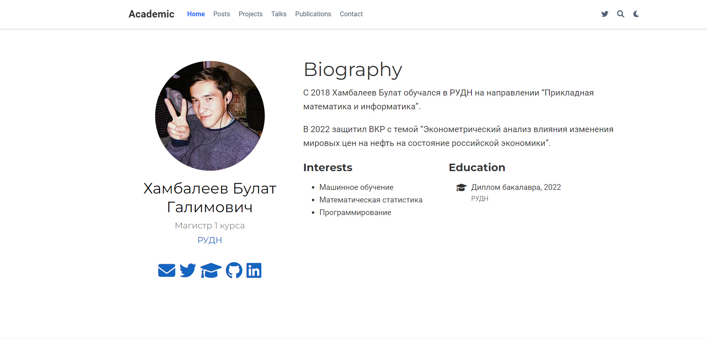

---
## Front matter
lang: ru-RU
title: Отчет по индвидуальному проекту, этап 2
author: 'Хамбалеев Булат Галимович'
date: 8 октября, 2022

## Formatting
toc: false
slide_level: 2
theme: metropolis
mainfont: Ubuntu
romanfont: Ubuntu
sansfont: Ubuntu
monofont: Ubuntu
header-includes: 
 - \metroset{progressbar=frametitle,sectionpage=progressbar,numbering=fraction}
 - '\makeatletter'
 - '\beamer@ignorenonframefalse'
 - '\makeatother'
aspectratio: 43
section-titles: true
---

## Цель работы

Добавить к сайту данные о себе.

## Задание

Данный этап индвидуального проекта подразумевает добавление некоторой информации о владельце, а также добавление нескольких постов.

# Выполнение лабораторной работы

1. Запишем описание, интересы, образование владельца сайта.

{ #fig:001 width=70% }

---

2. Добавим пост по прошедшей неделе.

{ #fig:002 width=70% }

---

3. Запишем пост на тему "Git. Управление версиями."

{ #fig:003 width=70% }

---

4. Загрузим изменения на сайт.

{ #fig:004 width=70% }

---

5. Проверим, отображаются ли посты.

{ #fig:005 width=70% }

---

## {.standout}

Спасибо за внимание
