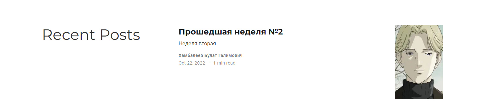

---
## Front matter
lang: ru-RU
title: Отчет по индвидуальному проекту, этап 3
author: 'Хамбалеев Булат Галимович'
date: 22 октября, 2022

## Formatting
toc: false
slide_level: 2
theme: metropolis
mainfont: Ubuntu
romanfont: Ubuntu
sansfont: Ubuntu
monofont: Ubuntu
header-includes: 
 - \metroset{progressbar=frametitle,sectionpage=progressbar,numbering=fraction}
 - '\makeatletter'
 - '\beamer@ignorenonframefalse'
 - '\makeatother'
aspectratio: 43
section-titles: true
---

## Цель работы

Добавить к сайту свои достижения.

## Задание

Данный этап индвидуального проекта подразумевает добавление некоторой информации о своих достижениях, а также некоторые посты.

# Выполнение лабораторной работы

1. Добавим информацию о навыках.

{ #fig:001 width=70% }

---

2. Добавим информацию об опыте. 

{ #fig:002 width=70% }

---

3. Добавим информацию о достижениях.

{ #fig:003 width=70% }

---

4. Сделаем пост по прошедшей неделе. 

{ #fig:004 width=70% }

---

5. Сделаем пост на тему "Язык разметки markdown".  

{ #fig:005 width=70% }

---

## {.standout}

Спасибо за внимание
