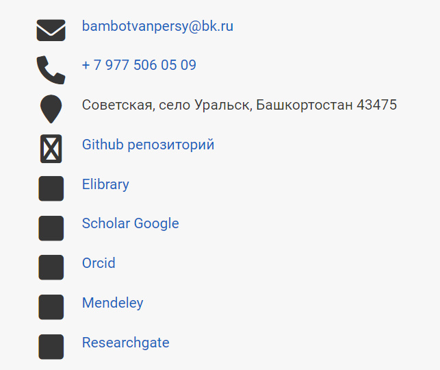
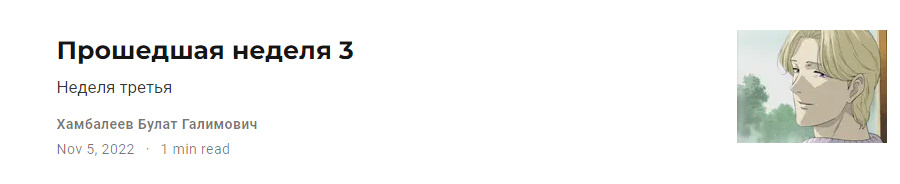
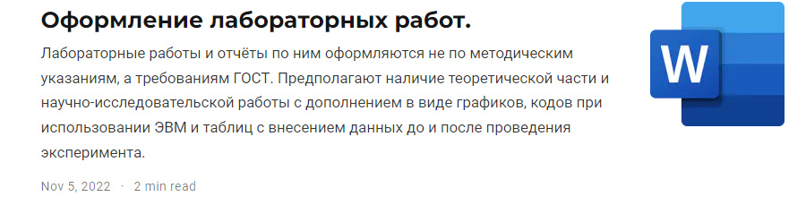

---
## Front matter
lang: ru-RU
title: Отчет по индвидуальному проекту, этап 4
author: 'Хамбалеев Булат Галимович'
date: 05 ноября, 2022

## Formatting
toc: false
slide_level: 2
theme: metropolis
mainfont: Ubuntu
romanfont: Ubuntu
sansfont: Ubuntu
monofont: Ubuntu
header-includes: 
 - \metroset{progressbar=frametitle,sectionpage=progressbar,numbering=fraction}
 - '\makeatletter'
 - '\beamer@ignorenonframefalse'
 - '\makeatother'
aspectratio: 43
section-titles: true
---

## Цель работы

Добавить к сайту свои контакты и добавить посты.

## Задание

Данный этап индвидуального проекта подразумевает добавление некоторой информации о своих контактах, а также некотороых постов.

# Выполнение лабораторной работы

1. Добавим информацию о контактах.

{ #fig:001 width=70% }

---

2. Добавим пост по прошедшей неделе. 

{ #fig:002 width=70% }

---

3. Добавим пост об оформлении лабораторных работ.

{ #fig:003 width=70% }

---

## {.standout}

Спасибо за внимание
